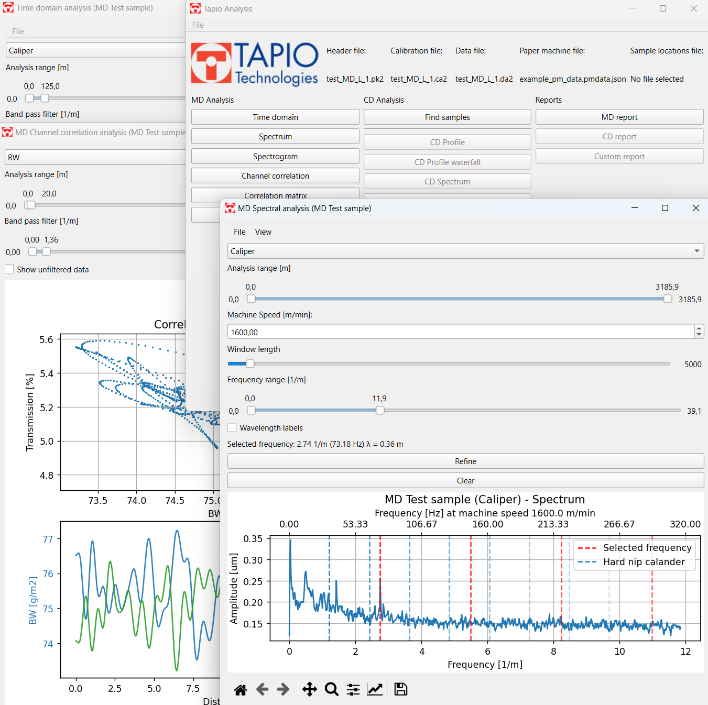
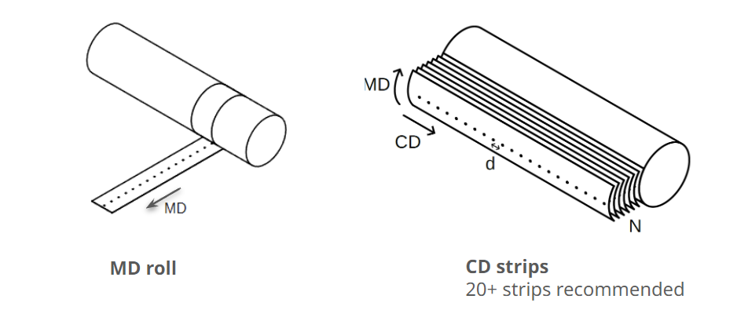

# Tapio Analysis

## Overview
Tapio Analysis is an open-source software developed by Tapio Measurement Technologies Oy. It is engineered to perform advanced analysis of measurements obtained from Tapio Analyzers, which are used extensively for troubleshooting, diagnostics and quality monitoring in the paper, board, and nonwoven industries.



## Use cases for Tapio Analysis
- **Cross Direction (CD) paper quality diagnostics**: Measuring true CD strips, the analyzer can measure true CD strips with sub-millimeter resolution, helping to detect CD issues such as streaks or periodic variations caused by sprays, actuators etc.
- **Machine direction (MD) diagnostics**: Unique software to link the wavelengths of the periodic variations observed in the paper to the rotating frequencies and actuator spacings of elements in your production line.
- **Before-after rebuild assessment**: Determine and quantify the changes caused by comparing measurements before and after the changes.
- **QCS verification**:  The Tapio Analyzer is calibrated before each measurement and measures at a slow speed in laboratory conditions. The software includes tools for verifying measurements of online QCS measurement heads or any other supplementary data and comparing it to the true CD profiles.
- **Formation and micro level studies**:  The Tapio Analyzer can measure variations from the kilometer scale down to millimeter scale, allowing studies of formation and other micro level phenomena.

## Key features

- **MD Profile**: Accurate and sub-millimeter resolution MD profiles with filtering and statistics display.
- **MD Spectrum**: Identifies wavelengths and frequencies where variations occur in the sample. Includes troubleshooting tools for connecting spectrum peaks to known rotating frequencies of machine elements.
- **MD Formation**: Long-term variations in formation index, an indicator describing short-term basis weight variation.
- **CD Profile**: True CD profile from actual CD strips with tools for filtering, mean profile calculation and statistics. Accurate data with sub-millimeter resolution.
- **CD Spectrum**: Quantify and find root cause of periodic CD variations originating from CD controls, actuators etc.
- **Spectral Coherence**: Identify which frequencies are shared or absent between different channels.
- **Spectrogram**: Study the stability of the periodic content in the sample along the length of the sample.
- **CD Formation**: Visualize formation index in different CD locations
- **Variance Component Analysis (VCA)**: Separate variation in MD and CD direction from random variations.
- **Correlation analysis tools**: Tapio Analyzers measure the exact same spot with each sensor, enabling the study of correlations between different quality parameters. The software allows studying correlations between different channels in CD profiles and MD profiles in the correlation matrix and channel-to-channel correlation tools.
- **Data export**: Convenient export of raw data in Excel and csv formats.
- **Graph and plot export**: Export every plot produced by the software in multiple image formats.
- **Reporting**: Automatically generate editable reports from measured data.

## Installation instructions

### Standard installation
- Download the latest release executable from the [Tapio Analysis releases page](https://github.com/Tapio-Measurement-Technologies/tapio-analysis/releases)
- The system does not require any installation, place the executable in a suitable place and create shortcuts as needed.
- Any default settings can be overridden by providing a path to local_settings.py as an argument to the executable.

### Installing from source code (custom installation)
To install Tapio Analysis, follow the steps below:
- [Install Python 3.12.1](https://www.python.org/downloads/release/python-3121/) (For Windows systems, use the [64-bit installer](https://www.python.org/ftp/python/3.12.1/python-3.12.1-amd64.exe). During installation, select the option "Add Python to environment variables").
- [Install Git](https://git-scm.com/)


Run the following in a command prompt:
```bash
# First navigate to the preferred installation folder
# Clone the repository
git clone https://github.com/Tapio-Measurement-Technologies/tapio-analysis
# Navigate to the project directory
cd tapio-analysis
# Run the installation script (the script installs Python dependencies in a virtualenv, creates src/local_settings.py, a launch script and a shortcut)
./install.bat
```

# Get the most out of Tapio Analysis
While Tapio Analysis is free and open-source, we offer a range of professional services to help you get the most out of the software. Our expert team is ready to assist you with customizations, training, and measurement services.

### Customizations
- **Tailored Export Formats**: Need a specific data format, for example an export to a mill system? We can create custom export options to fit your requirements.
- **Data Loaders**: Import any process with custom data loaders designed for your unique datasets.
- **Additional Features**: Request any additional analysis functionalities.

### Training
- **Training Courses**: Our training sessions ensure your team can fully utilize Tapio Analysis, from basic usage to advanced features.
- **Personalized Support**: One-on-one or group training and support sessions, both on-site and remote are available.

### Measurement services
- **Measurement service for all paper and board grades and other rolled products**: Tapio Measurement Technologies provides measurement service for customer provided CD strips or MD rolls at our lab in Espoo, Finland. The data is provided to customers after measurement. <br><br><small></small><br>
- **Expert analysis and detailed reporting**: Tapio experts can analyze the findings and provide a detailed report on the observations in the measured samples.

Contact us to discuss how we can help you optimize your production process.
- Email: [info@tapiotechnologies.com](mailto:info@tapiotechnologies.com)
- Visit: [https://www.tapiotechnologies.com](https://www.tapiotechnologies.com)


# User manual
For instructions on using Tapio Analysis, please refer to the [User manual](docs/tapio_analysis_manual.md).


# License
Tapio Analysis

Copyright 2025 Tapio Measurement Technologies Oy

Tapio Analysis is free software: you can redistribute it and/or modify it under the terms of the GNU General Public License as published by the Free Software Foundation, either version 3 of the License, or (at your option) any later version.

This program is distributed in the hope that it will be useful, but WITHOUT ANY WARRANTY; without even the implied warranty of MERCHANTABILITY or FITNESS FOR A PARTICULAR PURPOSE. See the GNU General Public License for more details.

You should have received a copy of the GNU General Public License along with this program. If not, see <https://www.gnu.org/licenses/>.


