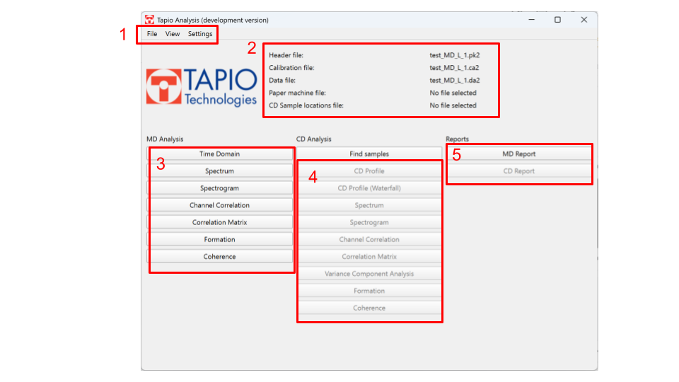
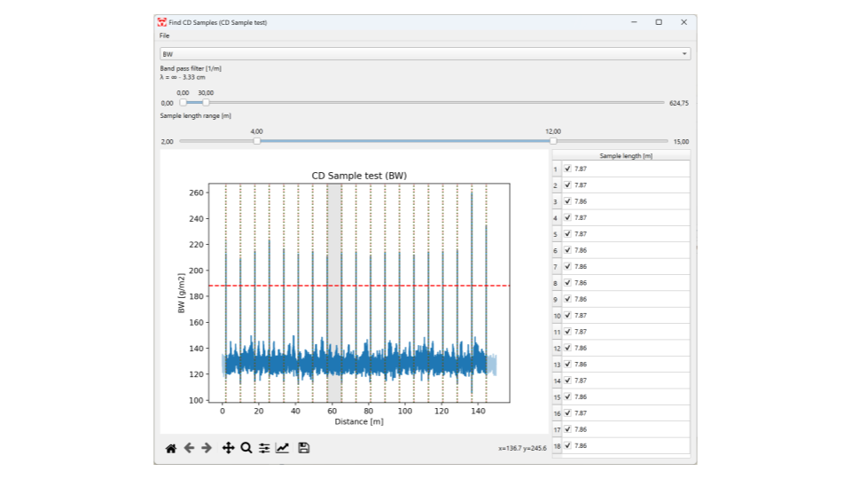

# Tapio Analysis user manual

## Table of contents
1. [Installing and updating the software](#installing-and-updating)
2. [User interface overview](#user-interface-overview)
3. [Opening Files](#opening-files)
4. [MD Analysis](#md-analysis)
5. [CD Analysis](#cd-analysis)
6. [Reports](#reports)

## Installing and updating
Follow the instructions in `README.md` to install the software.

To update to the most recent version, run the command: 
```bash
git pull
```
in the project folder and then re-run:
```bash
./install.ps1
```

## User interface overview
<br><br><small></small><br>
1. **File menu** for opening files and exporting data
2. **Currently open files**
3. **MD Analysis tools**
4. **CD Analysis tools** (these buttons are active only if the data has been split into CD samples with the Find samples tool)
5. **Tools for automatic report generation**

## General information
- Almost all analysis features have a dropdown menu to select the channel for investigation.
- Settings can be used to control the default filters, analysis regions, and other parameters in the analysis windows as well as the default reporting format.
- Any of the default settings defined in `settings.py` can be overridden in `local_settings.py`.
- The bottom toolbar has buttons for zooming and panning the plot as well as exporting it as an image.

## Opening files
### WinTapio files
- To open WinTapio files, select a header file, calibration file, and a data file all at once and press the open button.
- You can additionally select a JSON format paper machine file or a CD samples file along with any file open operation.

<br><br><small></small><br>

### Other data files
- The software uses data loaded in a Pandas dataframe. Please contact info@tapiotechnologies.com for more information.

## MD Analysis

### Time domain
- Visualize and filter the raw data, view statistics.

### Spectrum
- Identify frequencies and amplitudes of periodic components in the data, visualize the known rotating frequencies of components in the production line.
- **Use the middle mouse button to select a frequency**.
- Use the refine button to do fundamental frequency estimation (spectrum peak detection) in frequencies near the selected frequency. The refine button will adjust the selected frequency.
- `View -> Paper machine data` can be used to open the paper machine file to visualize the components on top of the spectrum.

### Spectrogram
- Investigate the frequencies and amplitudes of periodic components in the data over time or the length of the sample.
- Visualize the known rotating frequencies of components (rolls, wires, felts, pumps, etc.) in the production line.
- Use the refine button to do fundamental frequency estimation (spectrum peak detection) in frequencies near the selected frequency. The refine button will adjust the selected frequency.
- `View -> Paper machine data` can be used to open the paper machine file to visualize the components on top of the spectrum.

### Channel correlation
- Study the correlation in the data between any two channels.

### Correlation matrix
- Study the correlation coefficients between all channels at once.

### Formation
- Obtain a formation profile, describing the formation index over the length of the sample. The formation index is calculated from 1 mm aperture Transmission sensor data automatically correlated to basis weight sensor data to estimate basis weight.

## CD Analysis
- The CD analysis tools in Tapio Analysis are based on splitting a measurement of a sample roll consisting of multiple CD Strips separated by tapes into multiple CD profiles. The splitting is based on detecting the peaks caused by the tapes.
- CD analysis tools make use of the mean profile calculated from the individual CD strips.
- Each CD analysis feature has tools to select and deselect samples (`View -> Select samples`).

### Find samples
<br><br><small></small><br>

- Find samples is used to split a measured CD sample roll into individual CD samples (the samples are separated by tapes).
- Select a channel where the tapes are clearly visible and **use the middle mouse button to select a threshold level**.
- The sample locations can be saved from `File -> Save samples` for opening later.

### CD Profile
- View the mean CD profile with individual profiles or min/max profiles of the selected samples.

### CD Profile waterfall
- View all CD profiles at once.

### CD Spectrum
- Identify wavelengths and amplitudes of periodic components in the CD data, visualize the known actuator spacings of the production line.
- **Use the middle mouse button to select a frequency**.
- Use the refine button to do fundamental frequency estimation (spectrum peak detection) in frequencies near the selected frequency. The refine button will adjust the selected frequency.
- `View -> Paper machine data` can be used to open the paper machine file to visualize the components on top of the spectrum.

### CD Spectrogram
- Investigate the wavelengths and amplitudes of periodic components in the CD data over the length of the samples.
- **Use the middle mouse button to select a frequency**.
- Use the refine button to do fundamental frequency estimation (spectrum peak detection) in frequencies near the selected frequency. The refine button will adjust the selected frequency.
- `View -> Paper machine data` can be used to open the paper machine file to visualize the components on top of the spectrum.

### CD Channel correlation
- Study the correlation of the mean CD profile between any two channels.

### CD Correlation matrix
- Study the correlation coefficients between mean CD profiles in all channels at once.

### CD Formation
- Investigate the mean formation index of the CD profiles in different CD locations.

## Reports
- Tools for automatic report generation. The report structure can be specified in settings in JSON format.