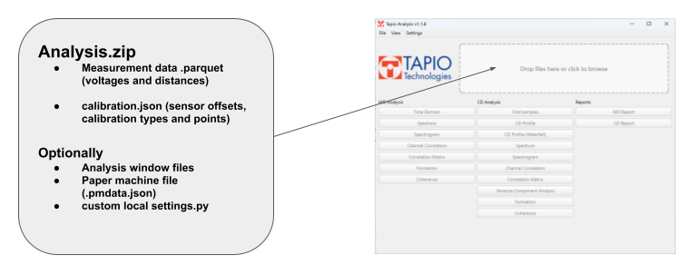
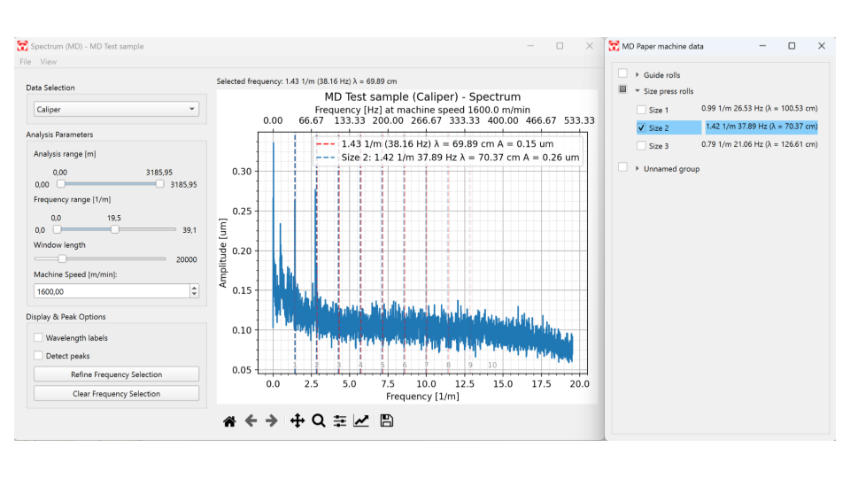

# Tapio Analysis User Manual

## Table of contents
1. [Installing and updating the software](#installing-and-updating)
2. [User interface overview](#user-interface-overview)
3. [Opening files](#opening-files)
4. [Settings system](#settings-system)
5. [MD Analysis](#md-analysis)
6. [CD Analysis](#cd-analysis)
7. [Paper Machine Data File](#pm-data-file)
8. [Reports](#reports)

## Installing Tapio Analysis

### Standard installation
- Download the latest release executable from the [Tapio Analysis releases page](https://github.com/Tapio-Measurement-Technologies/tapio-analysis/releases)
- The system does not require any installation, place the executable in a suitable place and create shortcuts as needed.
- Any default settings can be overridden by providing a path to local_settings.py as an argument to the executable.

### Installing from source code
To install Tapio Analysis, follow the steps below:
- [Install Python 3.12.1](https://www.python.org/downloads/release/python-3121/) (For Windows systems, use the [64-bit installer](https://www.python.org/ftp/python/3.12.1/python-3.12.1-amd64.exe). During installation, select the option "Add Python to environment variables").
- [Install Git](https://git-scm.com/)

Run the following in a command prompt:
```bash
# First navigate to the preferred installation folder
# Clone the repository
git clone https://github.com/Tapio-Measurement-Technologies/tapio-analysis
# Navigate to the project directory
cd tapio-analysis
# Run the installation script (the script installs Python dependencies in a virtualenv, creates src/local_settings.py, a launch script and a shortcut)
./install.bat
```

### Updating Tapio Analysis
To update to the most recent version , open a command prompt in the install folder and run the commands:
```bash
git pull
```
and then run the installation script again (only necessary if packages have been updated):
```bash
./install.bat
```

## User interface overview
<br><br><small></small><br>
1. **File menu** for opening files, exporting data, viewing logs, setting temporary settings
2. **Dropzone for opening files and viewing currently open files**
3. **MD Analysis tools**
4. **CD Analysis tools** (these buttons are active only if the data has been split into CD samples with the Find samples tool or by providing sample location files on data load)
5. **Tools for automatic report generation**

## General information
- Almost all analysis features have a dropdown menu to select the channel for investigation.
- Settings can be used to control the default filters, analysis regions, and other parameters in the analysis windows as well as the default reporting format.
- Any of the default settings defined in `settings.py` can be overridden in `local_settings.py`.
- The bottom toolbar has buttons for zooming and panning the plot as well as exporting it as an image.

## Opening files
### Tapio measurement and supplementary files 

- Use the dropzone to open files in Tapio Analysis. Drop the files in the dropzone simultaneously or packaged into a .zip file. Alternatively, use the File->Open menu to select a suitable data loader.
- To open a measurement, provide at least a calibration file and a data file simultaneously.
- You can additionally include header files, CD sample locations, analysis window files (will open at data load), custom settings or paper machine data files

<br><br><small></small><br>

### Other data files
- The software uses data loaded in a Pandas dataframe. Any data can be loaded and customization of the loader system is possible. Please contact info@tapiotechnologies.com for more information.


## Settings System
The `src/settings.py` file contains settings that influence the behavior of the software, such as the default positions of sliders, tape widths, and more.

All default settings visible in `src/settings.py` can be overridden by editing `src/local_settings.py`. For example, to change the tape width, add the following line in `local_settings.py`:

```python
TAPE_WIDTH_MM = 25
```

#### Note:
In an installation from source, use `src/local_settings.py` to override default settings.


### Calculated Channels
You can define custom calculated channels in settings. For instance, to add a channel for density, you would define a function to calculate the channel and then add it to the list of calculated channels:

```python
def calc_density(dataframe):
    return dataframe['BW'] / (dataframe['Caliper'] / 1000)

CALCULATED_CHANNELS = [
    {"name": "Density", "unit": "g/m^3", "function": calc_density}
]
```

### Fixed Y limits for spectrum
To allow for better comparison of the spectral content of different samples, the Y limits of spectra can be fixed per channel in settings.

```python
CD_SPECTRUM_FIXED_YLIM = {"Caliper": [0, 1], "Basis Weight": [0,1]}
MD_SPECTRUM_FIXED_YLIM = {"Caliper": [0, 1], "Basis Weight": [0,1]}
```

### Band pass filter slider decimals
The step and number of decimals visible in the filter slider can be edited:
```python
BAND_PASS_FILTER_DECIMALS = 5
BAND_PASS_FILTER_SINGLESTEP = 0.001
```

### Extra data adjustment sliders
It is possible to stretch and compress loaded supplementary CD data by altering the start and end points with sliders. The adjustment range can be controlled with a setting.
```python
EXTRA_DATA_ADJUST_RANGE = 1
```

### Display unit multipliers
The default unit of the software is meters. In profile views is possible to set a custom scaling factor and unit name for the plots.
```python
CD_PROFILE_DISPLAY_UNIT_MULTIPLIER = 1
CD_PROFILE_DISPLAY_UNIT = "m"
```


#### Note:
The old calculated channels from **WinTapio** do not work in **Tapio Analysis**. These old channels should be added to the `IGNORE_CHANNELS` list and re-generated using the new calculated channels functionality.


## MD Analysis

### Time domain
- Visualize and filter the raw data, view statistics.

### Spectrum
- Identify frequencies and amplitudes of periodic components in the data, visualize the known rotating frequencies of components in the production line.
- **Use the middle mouse button to select a frequency**.
- Use the refine button to do fundamental frequency estimation (spectrum peak detection) in frequencies near the selected frequency. The refine button will adjust the selected frequency.
- `View -> Paper machine data` can be used to open the paper machine file to visualize the components on top of the spectrum.

<br><br><small></small><br>

#### Note about spectral calculations in Tapio Analysis
All spectral calculations in the software are based on the Welch method, which involves splitting the data into overlapping windows, calculating the a spectrum for each window and averaging the results. This method helps reduce noise and deal with data instationarities but reduces frequencyt resolution. The choice of window length influences both the frequency resolution and noise levels in the spectrum.

The window length can be adjusted to balance between noise reduction and resolution enhancement. Shorter windows give better noise control but reduce frequency detail, while longer windows enhance frequency resolution at the cost of increased noise. The user can adjust the window length using the slider in the analysis interface. It is important to select a window size that highlights the peaks of interest with sufficient detail while minimizing noise.

The maximum frequency is determined by the Nyquist frequency, which depends on the sampling interval. For instance, if the sampling interval is 12.8 mm, the maximum frequency will be half of the sample rate (e.g. 625 cycles per meter for a 12.8 mm sampling interval).

# Visualization of harmonics
It is typical for rotating elements to cause peaks in the spectrum at integer multiples (harmonics) of their rotating frequency. The software provides tools to visualize these harmonics.  You can control how many harmonic frequencies are displayed by adjusting the setting MAX_HARMONICS_DISPLAY in the local_settings.py file.


### Spectrogram
- Investigate the frequencies and amplitudes of periodic components in the data over time or the length of the sample.
- Visualize the known rotating frequencies of components (rolls, wires, felts, pumps, etc.) in the production line.
- Use the refine button to do fundamental frequency estimation (spectrum peak detection) in frequencies near the selected frequency. The refine button will adjust the selected frequency.
- `View -> Paper machine data` can be used to open the paper machine file to visualize the components on top of the spectrum.

### Channel correlation
- Study the correlation in the data between any two channels.

### Correlation matrix
- Study the correlation coefficients between all channels at once.

### Formation
- Obtain a formation profile, describing the formation index over the length of the sample. The formation index is calculated from 1 mm aperture Transmission sensor data automatically correlated to basis weight sensor data to estimate basis weight.

## CD Analysis
- The CD analysis tools in Tapio Analysis are based on splitting a measurement of a sample roll consisting of multiple CD Strips separated by tapes into multiple CD profiles. The splitting is based on detecting the peaks caused by the tapes.
- CD analysis tools make use of the mean profile calculated from the individual CD strips.
- Each CD analysis feature has tools to select and deselect samples (`View -> Select samples`).

### Find samples
<br><br><small></small><br>

- Find samples is used to split a measured CD sample roll into individual CD samples (the samples are separated by tapes).
- Select a channel where the tapes are clearly visible and **use the middle mouse button to select a threshold level**.
- The sample locations can be saved from `File -> Save samples` for opening later.

### CD Profile
- View the mean CD profile with individual profiles or min/max profiles of the selected samples.

### CD Profile waterfall
- View all CD profiles at once.

### CD Spectrum
- Identify wavelengths and amplitudes of periodic components in the CD data, visualize the known actuator spacings of the production line.
- **Use the middle mouse button to select a frequency**.
- Use the refine button to do fundamental frequency estimation (spectrum peak detection) in frequencies near the selected frequency. The refine button will adjust the selected frequency.
- `View -> Paper machine data` can be used to open the paper machine file to visualize the components on top of the spectrum.

### CD Spectrogram
- Investigate the wavelengths and amplitudes of periodic components in the CD data over the length of the samples.
- **Use the middle mouse button to select a frequency**.
- Use the refine button to do fundamental frequency estimation (spectrum peak detection) in frequencies near the selected frequency. The refine button will adjust the selected frequency.
- `View -> Paper machine data` can be used to open the paper machine file to visualize the components on top of the spectrum.

### CD Channel correlation
- Study the correlation of the mean CD profile between any two channels.

### CD Correlation matrix
- Study the correlation coefficients between mean CD profiles in all channels at once.

### CD Formation
- Investigate the mean formation index of the CD profiles in different CD locations.


## Paper Machine Data File

The **paper machine data file** (`.pmdata.json`) contains information about the main mechanical elements in the production line.  This data is used to display the **rotating frequencies** (for MD) and **actuator or component spacings** (for CD) on top of the spectrum and spectrogram plots in Tapio Analysis.

The file should be placed in the same folder as the measurement files and can be loaded together with them.  

When loaded, Tapio Analysis calculates the frequencies or wavelengths of each component based on its **diameter** (for MD) or **length/spacing** (for CD) and overlays them on the relevant plots. It is also possible to directly provide frequencies for components.

---

### Paper Machine File structure

The paper machine data file is in **JSON format**, and it contains two main sections:

- **MD** – Describes the rotating elements of the machine (e.g. rolls, cylinders, press components).  
  Each element must have a `name` and `diameter` in meters.

- **CD** – Describes the cross-machine components (e.g. actuators, sprays, headbox elements).  
  Each element must have a `name` and `length` in meters (distance or spacing).

Each section can contain one or more *groups*, each with a `groupName` (optional) and a list of `elements`.

---

#### Example

Below is a complete example of a typical `paper_machine.pmdata.json` file:

```json
{
  "MD": [
    {
      "groupName": "Guide rolls",
      "elements": [
        { "name": "Wire 1", "diameter": 0.350 }
      ]
    },
    {
      "groupName": "Size press rolls",
      "elements": [
        { "name": "Size 1", "diameter": 0.320 },
        { "name": "Size 2", "diameter": 0.224 },
        { "name": "Size 3", "diameter": 0.403 }
      ]
    },
    {
      "elements": [
        { "name": "Breast roll", "diameter": 0.200 },
        { "name": "Press rolls", "diameter": 0.200 },
        { "name": "Dryer", "diameter": 0.403 },
        { "name": "Couch roll", "diameter": 0.263 },
        { "name": "Reel", "diameter": 0.317 },
        { "name": "Hard nip calander", "diameter": 0.115 }
      ]
    }
  ],
  "CD": [
    {
      "elements": [
        { "name": "Sprays", "length": 0.6 },
        { "name": "Wire spacing", "length": 0.1 }
      ]
    },
    {
      "groupName": "Group 1",
      "elements": [
        { "name": "Headbox lip actuators", "length": 0.200 }
      ]
    }
  ]
}


## Reports
- Tools for automatic report generation. The report structure can be specified in settings in JSON format.